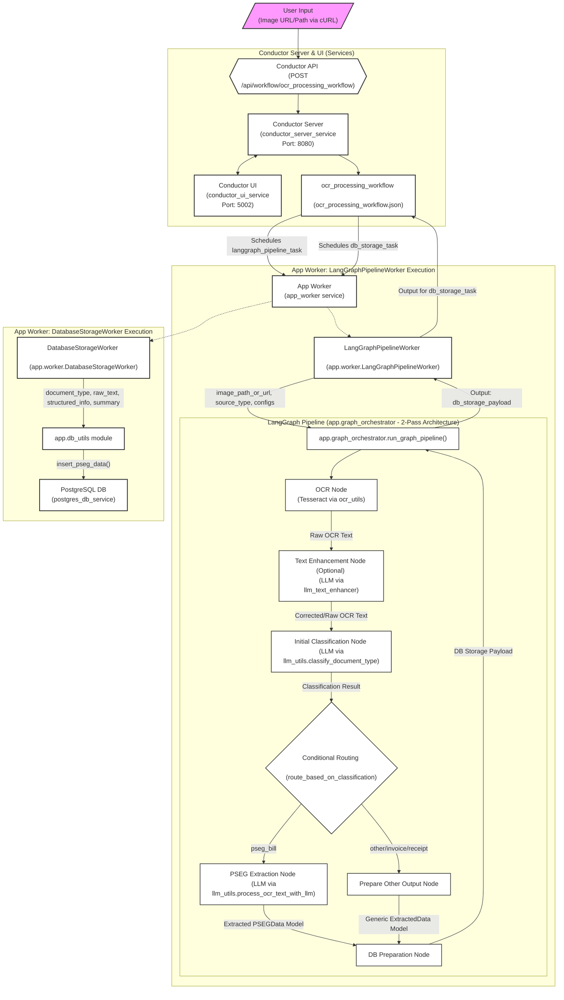

# LLM-Aided PSEG Utility Bill Processing Pipeline

## Introduction

This project implements a robust, containerized pipeline specifically designed for processing **PSEG utility bills** (submitted as images or PDFs). It leverages Optical Character Recognition (OCR) for text extraction. The core processing is managed by **LangGraph**, orchestrating a **2-pass sequence of steps**: 
1.  OCR (Tesseract).
2.  An initial LLM-based classification to determine the document type (e.g., 'pseg_bill').
3.  Conditional routing to a specialized LLM-based extraction process if classified as a PSEG bill, or a generic handler for other types. 

LangGraph's stateful nature is key to managing this multi-step flow and enabling iterative refinement. The extracted information, conforming to a PSEG-specific data model, is then stored in a PostgreSQL database. The overall workflow execution is managed by Netflix Conductor, which triggers a single worker that, in turn, runs the LangGraph pipeline. The system is managed with Docker and Docker Compose.

## Current Status & Key Findings

*   **Pipeline Functional**: The pipeline is confirmed to be working end-to-end for PSEG utility bills. It successfully performs OCR, classifies the document, extracts structured data for PSEG bills, and stores this data in the PostgreSQL database.
*   **Primary Focus**: The pipeline is tuned for processing **PSEG utility bills**.
*   **Orchestration**: The core OCR-Classify-Extract logic is managed by a **2-Pass LangGraph pipeline** (defined in `app.graph_orchestrator.py`), invoked by a single Conductor worker (`LangGraphPipelineWorker` in `app.worker.py`).
*   **Improved Extraction for PSEG Bills**: The 2-pass architecture, with an initial classification step followed by a specialized PSEG extraction step using a detailed prompt, effectively extracts data into the `PSEGData` model.
*   **OCR**: **Tesseract OCR is the default** for text extraction. Text enhancement with an LLM is available but currently disabled by default in the LangGraph pipeline worker.
*   **LLM Configuration**: 
    *   Uses `mistral:7b-instruct-q4_K_M` by default (or user-defined alternatives via `.env`) for classification and PSEG-specific extraction. 
    *   Utilizes `instructor` and `litellm` for reliable JSON output adhering to Pydantic models.
    *   Specific models can be set for the classifier (`OLLAMA_CLASSIFIER_MODEL_NAME`) and extractor (`OLLAMA_EXTRACTOR_MODEL_NAME`) via environment variables (see `app/config.py`).
*   **LLM Performance Note**: The default `mistral:7b-instruct-q4_K_M` model has been observed to be slow for the classification and extraction tasks, potentially taking several minutes per step. The configured `OLLAMA_REQUEST_TIMEOUT` (default 600 seconds) is generally sufficient, but patience is required during processing. Faster or more powerful LLMs, if available in your Ollama instance, might improve processing speed.
*   **Overall Pipeline**: The Conductor workflow (`ocr_processing_workflow.json`) defines `langgraph_pipeline_task` -> `db_storage_task`.

## Implemented 2-Pass LangGraph Architecture

To achieve reliable and detailed field extraction, a **2-pass data processing architecture within the LangGraph pipeline** is implemented:

1.  **`ocr_node`**: Performs OCR using Tesseract (via `app.ocr_utils`).
2.  **`text_enhancement_node`**: (Optional, currently bypassed by default worker configuration) Enhances OCR text using an LLM (via `app.llm_text_enhancer`).
3.  **`initial_classification_node`**:
    *   **Action**: Uses an LLM (configured by `OLLAMA_CLASSIFIER_MODEL_NAME`) with a prompt focused *primarily on document classification* ('pseg_bill', 'invoice', 'receipt', 'other').
    *   **Pydantic Model**: `SimpleClassificationOutput`.
    *   **Output**: `classification_result` (containing `document_type` and `confidence`).
4.  **`conditional_routing_node` (Edge Logic)**:
    *   **Action**: Based on `classification_result.document_type`, routes to a specialized extraction node or a generic handler.
5.  **`pseg_extraction_node`** (if classified as `pseg_bill`):
    *   **Action**: Uses an LLM (configured by `OLLAMA_EXTRACTOR_MODEL_NAME`) with a prompt *highly specialized and optimized for PSEG bills*. This prompt includes strong instructions for field population and a detailed PSEG few-shot example.
    *   **Pydantic Model**: `LLMResponseModel` (expecting `PSEGData` in `structured_data`).
    *   **Output**: `final_extracted_data_model` (containing an `ExtractedData` object with `PSEGData`).
6.  **`prepare_other_output_node`** (if not classified as `pseg_bill`):
    *   **Action**: Creates a standard `ExtractedData` object indicating the document type is 'other' or the initially classified type, with a note.
    *   **Output**: `final_extracted_data_model`.
7.  **`prepare_db_payload_node`**:
    *   **Action**: Consolidates information from `final_extracted_data_model` into the `db_storage_payload` structure expected by the `DatabaseStorageWorker`.

This 2-pass approach offers:
*   **Focused LLM Calls**: Each LLM call has a narrower, more manageable task.
*   **Optimized Prompts**: Prompts are tailored for classification versus detailed PSEG extraction.
*   **Improved Accuracy**: Higher accuracy in both classification and final field extraction for PSEG bills.
*   **Flexibility**: LangGraph allows for easier extension to other document types.

## Understanding the LLM's Use of Prompt Examples

The system uses detailed prompts to guide the Large Language Model (LLM) in its data extraction tasks. For instance, the PSEG bill extraction prompt (within `app/llm_utils.py` in the `DocumentProcessor` class) includes an example `Input Text Snippet` and a corresponding `Desired JSON Output`. It's important to understand how the LLM uses this example:

1.  **Instruction, Not Data Sourcing:** The example in the prompt serves as a *teaching tool*. It shows the LLM:
    *   What kind of information to look for (e.g., account numbers, dates).
    *   How to format that information (e.g., `YYYY-MM-DD` for dates).
    *   The expected JSON structure, including how to handle missing information (using `null`).
    This example is a fixed part of the instructions provided to the LLM for every PSEG bill it processes.

2.  **Processing New, Unseen Text:** When a new document is processed, its OCR'd text is inserted into the `{{{{text_content}}}}` placeholder within the prompt. The LLM's task is to apply the learned pattern (from the in-prompt example) to this *new text*.

3.  **Generalization, Not Copying:** The LLM is expected to *generalize* from the example, not simply copy the data from it. If it always outputted the example data regardless of the new document's content, the system would be flawed. Correct behavior involves:
    *   **Different Inputs, Different Outputs:** Extracted data should correspond to the *new* document.
    *   **Handling Variations:** The LLM should cope with slight variations in wording or layout different from the prompt's example.
    *   **Correct Use of Nulls:** If information is missing in the *new* document, the LLM should output `null` for those fields, as demonstrated in the example for fields not present in its snippet.

In essence, the prompt's example guides the LLM on *how* to perform the task on new data, rather than providing the data itself. The system's accuracy is validated by its ability to correctly process diverse documents it hasn't seen in its instruction prompt.

## Tracking LLM Calls and Estimating "Costs" (Local Ollama Setup)

When using local LLMs via Ollama, the "cost" isn't a direct monetary fee per API call or token (as with cloud-based LLM providers). Instead, costs are computational:

*   **Processing Time:** The duration for the LLM to generate a response, influenced by model size, hardware (CPU/GPU), and input/output length.
*   **Hardware Resources:** CPU/GPU utilization, RAM, and disk I/O.
*   **Energy Consumption:** Power used by the hardware.

Here's how to approach tracking usage in this system:

### 1. Counting LLM Calls

The number of LLM calls can be determined by analyzing the application logic:

*   **LangGraph Pipeline (`app/graph_orchestrator.py`):**
    *   **`initial_classification_node`**: **1 LLM call** (via `app.llm_utils.classify_document_type`).
    *   **`pseg_extraction_node`**: **1 LLM call** (via `app.llm_utils.process_ocr_text_with_llm`).
    *   **`enhance_text_node`** (Currently disabled by default in `app.worker.py`): If enabled, this node calls `app.llm_text_enhancer.enhance_text`, which makes **1 LLM call per text chunk**. So, this would add `N` calls, where `N` is the number of chunks.

*   **Default Pipeline:** For each document processed through the default LangGraph pipeline (with enhancement disabled), there are a baseline of **2 LLM calls**.

### 2. Estimating/Tracking Token Counts

Tracking exact token counts with a local Ollama setup via LiteLLM and `instructor` is more nuanced than with paid APIs that explicitly return token usage.

*   **Ollama API & Token Information:** Ollama's API can return token information (e.g., `prompt_eval_count`, `eval_count`) in its JSON responses.
*   **LiteLLM's Role:** LiteLLM, when calling Ollama, typically gets this usage information in its `ModelResponse` object (e.g., `response.usage['prompt_tokens']`).
*   **Challenge with `instructor`:** The `instructor` library (used in `app.llm_utils.py`) parses the LLM's content directly into Pydantic models. This convenience can make accessing LiteLLM's raw `ModelResponse` (and thus the `usage` stats) less direct.
*   **Challenge with LangChain:** Similarly, in `app.llm_text_enhancer.py`, LangChain's `LLMChain` abstracts direct access to the raw response containing token counts.

**Potential Approaches for Token Tracking (if crucial):**

1.  **LiteLLM Callbacks:** LiteLLM offers a `success_callback` mechanism. You could append a custom logging function to `litellm.success_callback` to capture and log the `kwargs` (input) and `result.usage` (token counts) for every successful LiteLLM call made to Ollama. This is likely the most robust way to capture token counts globally for all LiteLLM interactions.
2.  **`instructor` & Raw Response:** Investigate if `instructor` provides a way to access the underlying raw completion object from LiteLLM after a successful call.
3.  **LangChain Callbacks:** For parts using LangChain (like the text enhancer), explore LangChain's callback system (e.g., custom `BaseCallbackHandler`) to tap into methods like `on_llm_end`, which might provide access to response objects containing token usage.
4.  **Manual Estimation (for reference):** To get a rough idea of token counts (e.g., if you were comparing to a cloud model), you could use a library like `tiktoken` to tokenize your prompts and generated text using a specific model's encoding.

For this local setup, focusing on **processing time and system resource utilization** might be more practical day-to-day "cost" metrics than precise token counts, unless you implement specific mechanisms like LiteLLM callbacks to capture them.

## Architecture Overview

The system comprises several Docker services:

*   **App Worker (`app_worker` service):** Python application defining Conductor workers. 
    *   `LangGraphPipelineWorker`: Runs the main document processing graph.
    *   `DatabaseStorageWorker`: Handles database insertion.
*   **Conductor Server (`conductor-server` service):** Netflix Conductor server for workflow orchestration.
*   **Conductor UI (`conductor-ui` service):** Web interface for Conductor.
*   **Ollama (`ollama` service):** Provides access to local LLMs.
*   **PostgreSQL (`postgres_db` service):** Database for storing extracted data.
*   **Redis (`redis` service):** Used by Conductor.

### Architectural Diagram



## Core Workflow: `ocr_processing_workflow`

The Conductor workflow (`ocr_processing_workflow.json`) consists of:

1.  **`langgraph_pipeline_task`**:
    *   Managed by `app.worker.LangGraphPipelineWorker`.
    *   Invokes the 2-pass LangGraph pipeline.
    *   Output: Payload including `document_type`, `raw_text`, `structured_info`, `summary`.
2.  **`db_storage_task`**:
    *   Managed by `app.worker.DatabaseStorageWorker`.
    *   Stores data into PostgreSQL if `document_type` is `pseg_bill`.
    *   Output: `db_storage_status`, `db_id`.

## Key Modules (`app/` directory)

*   **`graph_orchestrator.py`**: Defines the LangGraph pipeline, state, nodes, and execution logic.
*   **`worker.py`**: Defines Conductor workers (`LangGraphPipelineWorker`, `DatabaseStorageWorker`).
*   **`ocr_utils.py`**: Handles OCR (Tesseract default), PDF conversion, image preprocessing.
*   **`llm_text_enhancer.py`**: Provides optional OCR text correction.
*   **`llm_utils.py`**: Contains `classify_document_type` and `DocumentProcessor` (for PSEG extraction) using `instructor` and `litellm`.
*   **`llm_response_models.py`**: Pydantic models for LLM outputs (`LLMResponseModel`, `SimpleClassificationOutput`).
*   **`models.py`**: Core data models (`PSEGData`, `ExtractedData`).
*   **`config.py`**: Central configuration (Ollama URLs, model names, timeouts).
*   **`db_utils.py`**: Database schema and data insertion.
*   **`config_models.py`**: Pydantic models for `OCRConfig`, `LLMConfig`.

## Technologies Used

*   Python 3.10+
*   Docker & Docker Compose
*   Netflix Conductor (Workflow Orchestration)
*   Ollama (Local LLM Serving)
*   Tesseract OCR
*   `instructor` library (Structured LLM Output)
*   `litellm` library (LLM Interface)
*   Pydantic (Data Validation & Settings)
*   PostgreSQL (Database)
*   LangGraph (Graph-based Agentic Workflows)
*   `pdf2image`, `OpenCV` (python-headless), `httpx`, `requests`

## Understanding Key Components: Configuration, LLM Output, and Workflow Orchestration

This project leverages several powerful Python libraries and design patterns. Understanding their distinct roles is key to grasping the overall architecture:

### 1. Pydantic `BaseSettings` (Conceptual: For Configuration Management)

*   **Purpose**: While the current `app/config.py` primarily uses direct `os.getenv()` calls for loading environment variables, it includes a commented-out example highlighting Pydantic's `BaseSettings` (from the `pydantic-settings` library). This pattern offers a robust and type-safe way to manage application configuration settings.
*   **How it Works**: With `BaseSettings`, you define a class where fields represent configuration parameters (e.g., API keys, model names, database URLs). This class can automatically load these settings from environment variables or `.env` files, apply default values, and critically, validate their types and constraints using Pydantic's validation power.
*   **Benefits**: Ensures type safety for configurations, centralizes defaults, and provides a structured way to access settings.
*   **Role in this Project (Conceptual)**: If fully implemented as per the example in `app/config.py`, `BaseSettings` would be responsible for loading and validating all static configurations needed by the application before any processing begins (e.g., Ollama URLs, default model names, Conductor server addresses).
*   **Distinction**: `BaseSettings` is for defining and loading the *static setup parameters* of the application. It differs from:
    *   **`instructor`**: Which is for processing the *dynamic output* from LLM calls at runtime to fit a Pydantic model.
    *   **`LangGraph`**: Which *orchestrates the execution flow* and manages changing state between processing steps, potentially using configurations loaded via `BaseSettings`.

### 2. `instructor` Library (for Structured LLM Output)

*   **Purpose**: To reliably obtain structured JSON output from Large Language Models (LLMs) that strictly conforms to a predefined Pydantic model.
*   **How it Works**: `instructor` patches an LLM client (in this project, `litellm`, which connects to Ollama). When an LLM call is made with a specified `response_model` (a Pydantic model), `instructor` guides the LLM (often by providing its Pydantic model's JSON schema within the prompt) to generate output matching this model. It then parses and validates the LLM's JSON response against that Pydantic model.
*   **Benefits**: Provides reliable structured data from LLMs, validates this data against your defined models, and can handle retries if validation fails.
*   **Role in this Project**: Used in `app/llm_utils.py` (via `instructor_litellm_client`):
    *   For document classification, it ensures the LLM's output matches the `SimpleClassificationOutput` model.
    *   For PSEG bill data extraction, it ensures the output matches the `LLMResponseModel` (which expects `PSEGData` in its `structured_data` field).
*   **Distinction**: `instructor` uses Pydantic models to define the *desired structure of LLM responses*. It differs from:
    *   **Pydantic `BaseSettings`**: Which uses Pydantic models to load and validate *static application configuration*.
    *   **`LangGraph`**: Which orchestrates workflows that *may include steps* using `instructor` to interact with LLMs.

### 3. `LangGraph` (for Workflow Orchestration)

*   **Purpose**: To build stateful, multi-step applications, particularly those involving LLMs and other tools, by defining them as a computational graph.
*   **How it Works**: You define a `state` object (e.g., `DocumentGraphState` in this project), `nodes` (Python functions that operate on and update the state), and `edges` (which define the flow between nodes, including conditional routing). `LangGraph` executes this graph, managing the state as it passes from one node to the next.
*   **Benefits**: Manages state across complex operations, allows for modular node design, supports conditional logic for dynamic routing, and enables cycles for iterative processes.
*   **Role in this Project**: The core of the document processing pipeline is defined and executed using `LangGraph` in `app/graph_orchestrator.py`. It manages the flow from OCR, through optional enhancement, to classification, then conditional extraction (PSEG or other), and finally to payload preparation for database storage.
*   **Distinction**: `LangGraph` is the *orchestration framework* for the entire multi-step process. It differs from:
    *   **Pydantic `BaseSettings`**: Which provides *static configurations* that components within the LangGraph might use.
    *   **`instructor`**: Which is a specialized tool that a *node within the LangGraph graph* might use to get structured output from an LLM during its execution.

In summary, Pydantic `BaseSettings` (conceptually) sets the stage with validated configurations. `instructor` ensures specific LLM interactions yield usable, structured data. `LangGraph` directs the entire play, managing the sequence of actions and the evolving state of the process.

## Operational Guide

### Prerequisites

1.  **Docker and Docker Compose:** Ensure they are installed and running.
2.  **Git:** For cloning this repository.
3.  **Cloned Conductor Repository (Required for building Conductor services):**
    *   The Conductor server and UI are built from source. Clone the official Conductor repository *alongside* this project's directory.
    *   Example: If this project is at `your_workspace/llm_ocr_doc_intel`, clone Conductor to `your_workspace/conductor`:
        ```bash
        # In your_workspace/ (i.e., the parent directory of llm_ocr_doc_intel)
        git clone https://github.com/conductor-oss/conductor.git
        ```
4.  **Ollama Models:**
    *   Ensure the LLMs specified in `app/config.py` (and potentially your `.env` file) are pulled into your local Ollama instance. Key models:
        *   `OLLAMA_EXTRACTOR_MODEL_NAME` (default: `mistral:7b-instruct-q4_K_M`)
        *   `OLLAMA_CLASSIFIER_MODEL_NAME` (defaults to extractor model, e.g., `mistral:7b-instruct-q4_K_M`)
    *   Example pull command: 
        ```bash
        ollama pull mistral:7b-instruct-q4_K_M
        ```
        (Pull any other models you configure, e.g., for text enhancement or if you change the defaults).
5.  **Environment Variables (`.env` file - Optional):**
    *   Create a `.env` file in the project root (`llm_ocr_doc_intel/.env`) to override default configurations from `app/config.py`. For example:
        ```env
        # Example .env content
        # OLLAMA_EXTRACTOR_MODEL_NAME=another_ollama_model:latest
        # OLLAMA_CLASSIFIER_MODEL_NAME=a_faster_classifier_model:latest
        # OLLAMA_REQUEST_TIMEOUT=300 
        ```

### Step 1: Build and Start Services

1.  **Navigate to the project directory:**
    ```bash
    cd path/to/your/llm_ocr_doc_intel
    ```
2.  **Build and start all services in detached mode:**
    This builds images, including Conductor from your local clone. The first build can take several minutes. Subsequent builds will be faster.
    ```bash
    docker-compose up -d --build
    ```
    *   Wait for services to initialize, especially `conductor-server`. You can check status with `docker-compose ps`. `conductor-server` should show `(healthy)`. This might take 1-2 minutes after the `up` command finishes.

### Step 2: Register Conductor Workflow

    (Only needed once, or if `ocr_processing_workflow.json` changes).

1.  **Ensure Conductor server is healthy.**
2.  **Register the workflow definition:**
        ```bash
        curl -X POST -H "Content-Type: application/json" -H "Accept: application/json" \
             --data @ocr_processing_workflow.json \
             http://localhost:8080/api/metadata/workflow | cat
        ```
    *   A `409` status code (e.g., `{"status":409,"message":"Workflow with ocr_processing_workflow.X already exists!"...}`) means it's already registered, which is fine. An empty response or success message also indicates success.

### Step 3: Process a Document (Start a Workflow)

1.  **Use `curl` to submit a document.** The `PSEG2.pdf` file is included in the repository for testing.
    The `docker-compose.yml` mounts the project root to `/usr/src/app/mounted_project_files` inside the `app_worker` container.
    ```bash
    curl -X POST -H "Content-Type: application/json" \
         -d '{ "image_path_or_url": "/usr/src/app/mounted_project_files/PSEG2.pdf", "source_type": "path" }' \
         http://localhost:8080/api/workflow/ocr_processing_workflow | cat
    ```
    *   The output of this command is the Workflow Instance ID (e.g., `xxxxxxxx-xxxx-xxxx-xxxx-xxxxxxxxxxxx`). Note this ID for tracking.

### Step 4: Monitor and Verify

1.  **Check `app_worker` Logs:**
    *   To follow logs in real-time (useful immediately after starting a workflow):
        ```bash
        docker-compose logs -f app_worker
        ```
    *   To view recent logs (e.g., the last 300 lines):
    ```bash
        docker-compose logs --tail="300" app_worker | cat
        ```
    *   Look for log entries related to OCR, classification, PSEG extraction (including the parsed JSON output upon success), and database storage.
    *   **Note on LLM Speed:** As mentioned, the default LLM can be slow. It might take several minutes (5-10+ min) for the entire workflow to complete. Check logs periodically.

2.  **Access Conductor UI:**
    *   Open your browser to `http://localhost:5002`.
    *   Search for your Workflow Instance ID (from Step 3) under "Workflow Executions."
    *   Inspect the visual representation of the workflow, the status of each task (`langgraph_pipeline_task`, `db_storage_task`), and their inputs/outputs. The output of `langgraph_pipeline_task` will contain the full `ExtractedData` JSON.
    *   **Note on Future System Dates & UI Search:** If your system's clock (and thus the Docker containers' clocks) is set to a date significantly in the future, the default search in the Conductor UI might not show your workflows because it typically searches for recent, real-world past executions.
        *   **Workaround:** You can usually access a specific workflow instance directly if you know its ID by navigating to: `http://localhost:5002/execution/YOUR_WORKFLOW_ID` (replace `YOUR_WORKFLOW_ID` with the actual ID).
        *   Alternatively, try adjusting the date range filters in the search UI to match your system's future date.

3.  **Check Database Contents:**
    *   The `db_storage_task` in Conductor UI (or `app_worker` logs) should indicate the `db_id` if data was stored.
    *   To connect directly to the PostgreSQL database using `psql`:
    ```bash
    docker exec -it postgres_db_service psql -U pseguser -d psegdb
    ```
    *   Once inside the `psql` prompt (`psegdb=#`):
        *   To see all tables: `\\dt`
        *   To see columns of `pseg_bills` table: `\\d pseg_bills`
        *   To select data for a specific ID (replace `YOUR_DB_ID` with the actual ID, e.g., `10`):
    ```sql
    SELECT * FROM pseg_bills WHERE id = YOUR_DB_ID;
            ```
        *   To see the 5 most recently added PSEG bills:
            ```sql
            SELECT * FROM pseg_bills ORDER BY created_at DESC LIMIT 5;
            ```
        *   To exit `psql`: `\\q`

### Step 5: Stopping Services

*   To stop all running services:
    ```bash
    docker-compose down
    ```
*   To stop and remove volumes (e.g., to clear database data):
    ```bash
    docker-compose down -v
    ```

## Troubleshooting & Considerations

*   **LLM Slowness/Timeouts:**
    *   The default `mistral:7b-instruct-q4_K_M` can be slow. If workflows seem stuck or take excessively long:
        1.  **Patience:** The default timeout (`OLLAMA_REQUEST_TIMEOUT` in `app/config.py`) is 600 seconds. It can genuinely take this long for some steps.
        2.  **Ollama Logs:** Check `ollama` service logs (`docker-compose logs ollama`) for any errors from the LLM itself.
        3.  **Increase Timeout:** Consider increasing `OLLAMA_REQUEST_TIMEOUT` in `.env` (or `app/config.py`) and rebuild `app_worker` (`docker-compose up -d --build app_worker`).
        4.  **Change LLM Model:** If you have a more powerful/faster LLM available in your Ollama setup, configure it via `.env` (e.g., `OLLAMA_CLASSIFIER_MODEL_NAME="your_faster_model:latest"`, `OLLAMA_EXTRACTOR_MODEL_NAME="your_powerful_model:latest"`) and rebuild.
*   **Conductor UI Issues:** If the UI at `http://localhost:5002` is not loading, check `conductor-ui` and `conductor-server` logs. Ensure services are healthy via `docker-compose ps`.
    *   **Search Not Showing Workflows (Future System Date):** As mentioned in "Step 4: Monitor and Verify", if your system clock is set to a future date, the Conductor UI's default search may not find your workflows.
        *   **Solution 1 (Recommended Workaround):** Access workflow instances directly via URL: `http://localhost:5002/execution/YOUR_WORKFLOW_ID`.
        *   **Solution 2:** Adjust the date range filters in the UI's search section to span the future date your system is set to.
        *   **Underlying Cause:** This is likely due to how Conductor's default search (especially with `redis_standalone` persistence) indexes or queries for workflows based on timestamps. Direct ID lookups bypass this search indexing.
*   **`403 Forbidden` on `git push`:** If you encounter permission errors when pushing to GitHub, ensure your local Git client is authenticated correctly for the target repository (e.g., correct user, valid SSH key or Personal Access Token).

## Future Enhancements

*   Experiment with different/more powerful LLMs for classification and extraction.
*   Refine prompts for even greater accuracy or to handle more variations.
*   Add support for other document types with dedicated LangGraph nodes and Pydantic models.
*   Implement more sophisticated data validation and confidence scoring.
*   Develop a simple frontend for easier interaction and visualization of extracted data.


